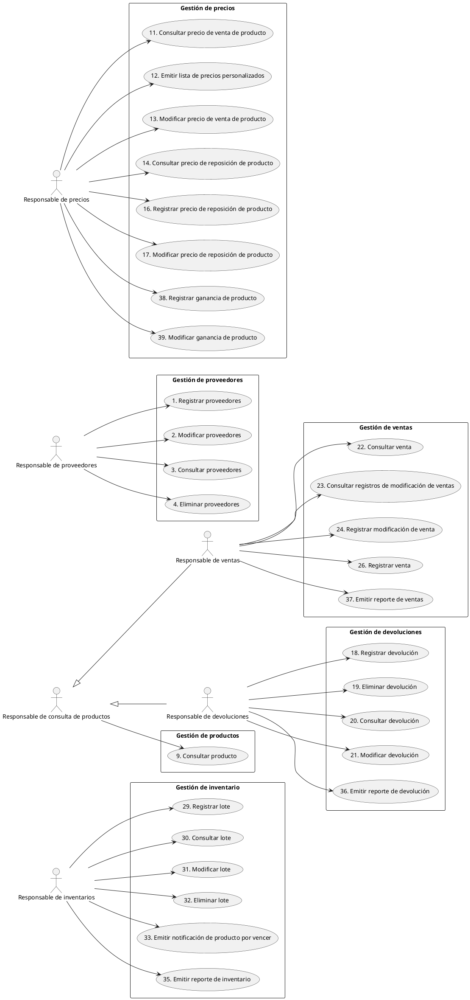

```plantuml
@startuml
left to right direction
skinparam packageStyle rectangle

'======================
' Actores
'======================
actor "Responsable de consulta de productos" as RCP
actor "Responsable de proveedores" as RP
actor "Responsable de inventarios" as RI
actor "Responsable de precios" as RPR
actor "Responsable de ventas" as RV
actor "Responsable de devoluciones" as RD

'======================
' Herencia
'======================
RCP <|-- RV
RCP <|-- RD

'======================
' Columna 1
'======================
together {
  package "Gestión de proveedores" {
    usecase "1. Registrar proveedores" as UC1
    usecase "2. Modificar proveedores" as UC2
    usecase "3. Consultar proveedores" as UC3
    usecase "4. Eliminar proveedores" as UC4
  }

  RP --> UC1
  RP --> UC2
  RP --> UC3
  RP --> UC4
}

'======================
' Columna 2
'======================
together {
  package "Gestión de productos" {
    usecase "9. Consultar producto" as UC9
  }

  RCP --> UC9

  package "Gestión de inventario" {
    usecase "29. Registrar lote" as UC29
    usecase "30. Consultar lote" as UC30
    usecase "31. Modificar lote" as UC31
    usecase "32. Eliminar lote" as UC32
    usecase "33. Emitir notificación de producto por vencer" as UC33
    usecase "35. Emitir reporte de inventario" as UC35
  }

  RI --> UC29
  RI --> UC30
  RI --> UC31
  RI --> UC32
  RI --> UC33
  RI --> UC35
}

'======================
' Columna 3
'======================
together {
  package "Gestión de precios" {
    usecase "11. Consultar precio de venta de producto" as UC11
    usecase "12. Emitir lista de precios personalizados" as UC12
    usecase "13. Modificar precio de venta de producto" as UC13
    usecase "14. Consultar precio de reposición de producto" as UC14
    usecase "16. Registrar precio de reposición de producto" as UC16
    usecase "17. Modificar precio de reposición de producto" as UC17
    usecase "38. Registrar ganancia de producto" as UC38
    usecase "39. Modificar ganancia de producto" as UC39
  }

  RPR --> UC11
  RPR --> UC12
  RPR --> UC13
  RPR --> UC14
  RPR --> UC16
  RPR --> UC17
  RPR --> UC38
  RPR --> UC39
}

'======================
' Columna 4
'======================
together {
  package "Gestión de ventas" {
    usecase "22. Consultar venta" as UC22
    usecase "23. Consultar registros de modificación de ventas" as UC23
    usecase "24. Registrar modificación de venta" as UC24
    usecase "26. Registrar venta" as UC26
    usecase "37. Emitir reporte de ventas" as UC37
  }

  RV --> UC22
  RV --> UC23
  RV --> UC24
  RV --> UC26
  RV --> UC37

  package "Gestión de devoluciones" {
    usecase "18. Registrar devolución" as UC18
    usecase "19. Eliminar devolución" as UC19
    usecase "20. Consultar devolución" as UC20
    usecase "21. Modificar devolución" as UC21
    usecase "36. Emitir reporte de devolución" as UC36
  }

  RD --> UC18
  RD --> UC19
  RD --> UC20
  RD --> UC21
  RD --> UC36
}

@enduml

```
